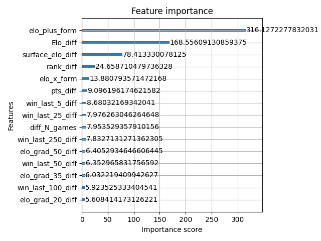
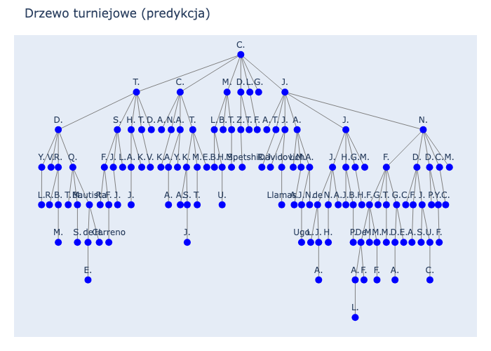

# Raport: Predykcja wyników meczów tenisowych ATP

## Spis treści

1. [Cel projektu](#cel-projektu)  
2. [Przebieg projektu](#przebieg-projektu)  
3. [Dane i preprocessing](#dane-i-preprocessing)  
4. [Co pominąłem?](#co-pominąłem)  
5. [Modele ML](#modele-ml)
6. [Użycie ensemble stacking](#użycie-ensemble-stacking)
7. [Wizualizacje i interpretacja](#wizualizacje-i-interpretacja)  
8. [Test na prawdziwej drabince turniejowej](#test-na-prawdziwej-drabince-turniejowej)  
9. [Techniczne szczegóły](#techniczne-szczegóły)  
10. [Podsumowanie](#podsumowanie)  

---

## Cel projektu

Moim celem było stworzenie modelu machine learningowego, który na podstawie danych historycznych przewiduje **czy zawodnik nr 1 wygra mecz**. Predykcja ma charakter binarny (0 = przegrana, 1 = wygrana) i opiera się wyłącznie na cechach zawodników oraz danych meczowych – bez użycia kursów bukmacherskich.

---

## Przebieg projektu

Na początku użyłem klasycznego modelu **Random Forest**, który osiągnął przyzwoite wyniki (accuracy ~60%). Po analizie wyników i wydajności postanowiłem wypróbować **XGBoost**, znany z dużej skuteczności na danych tablicowych i dobrej kontroli nad błędem generalizacji.

Dzięki jego zastosowaniu udało mi się poprawić wynik (AUC ≈ 0.738) oraz uzyskać lepszą interpretowalność cech.

Dodatkowo wykorzystałem **Optuna** do optymalizacji hiperparametrów. Pozwoliło mi to jeszcze bardziej poprawić działanie modelu XGBoost – AUC wzrosło o ok. 2 punkty procentowe, a accuracy osiągnęło około 64.5%.

---

## Dane i preprocessing

Dane wejściowe pochodziły ze zbioru spotkań ATP (`atp_tennis.csv`), który następnie przetworzyłem i zapisałem jako `atp_tennis_processed.csv`, potem został on jeszcze raz przetworzony do testów dla drabinki turniejowej - problemem była kolejność inicjałów tenisisty, czyli ostateczny plik jest zapisany jako `atp_tennis_processed_test.csv`. 

### Inżynieria cech

Stworzyłem wiele nowych zmiennych, m.in.:

- Punkty ELO (`Elo_diff`, `surface_elo_diff`)
- Różnice rankingowe i formy (`rank_diff`, `win_last_100_diff`)
- Historia H2H (`h2h_diff`, `h2h_surface_diff`)
- Złożone cechy łączące ELO i formę:
  - `elo_x_form = Elo_diff * win_last_100_diff`
  - `elo_form_ratio = Elo_diff / (win_last_100_diff + ε)`
  - `elo_plus_form = Elo_diff + win_last_100_diff`

#### Przykład: ELO w czasie dla top 5 graczy

  

---

Aby uchwycić aktualną formę zawodników oraz ich historię rywalizacji, przygotowałem funkcje, które dynamicznie obliczają cechy na podstawie danych historycznych do danego dnia (`Date`). Cechy te mogą znacząco wspierać model predykcyjny, umożliwiając mu analizę trendów i wzorców w grze zawodników.

### Wygrane w ostatnich N meczach

Dla każdego meczu obliczyłem współczynnik zwycięstw z ostatnich:

- 5 (`win_last_5_diff`)
- 25 (`win_last_25_diff`)
- 50 (`win_last_50_diff`)
- 100 (`win_last_100_diff`)
- 250 (`win_last_250_diff`)

dla obu zawodników, a następnie zapisałem ich różnicę. Pozwala to modelowi rozpoznać, który z zawodników jest w lepszej formie krótkoterminowej lub długoterminowej.

### Gradient rankingu ELO

Gradient rankingu ELO mierzy tempo zmiany siły zawodnika na przestrzeni ostatnich n meczów. Obliczamy go jako różnicę pomiędzy rankingiem ELO w najnowszym meczu a rankingiem ELO sprzed n meczów, podzieloną przez n. 

Ta cecha pozwala ocenić, czy zawodnik jest na fali wznoszącej (rosnące ELO) lub czy jego forma spada.

Gradienty obliczane są dla różnych długości serii meczów: 20, 35, 50 i 100, a następnie tworzymy cechy różnicowe pomiędzy dwoma zawodnikami:

- `elo_grad_20_diff`
- `elo_grad_35_diff`
- `elo_grad_50_diff`
- `elo_grad_100_diff`

### Stosunek zwycięstw na ostatnich n meczach

Ta cecha mierzy skuteczność zawodnika w jego ostatnich n meczach przed datą danego spotkania. Obliczamy stosunek liczby zwycięstw do liczby rozegranych meczów w tym okresie. W przypadku braku danych o poprzednich meczach zawodnika, przyjmujemy neutralną wartość 0.5.

### Historia bezpośrednich pojedynków (H2H)

Historia bezpośrednich pojedynków między dwoma zawodnikami to istotna cecha, która pomaga ocenić, jak często i z jakim skutkiem mierzyli się oni ze sobą w przeszłości. 

Funkcja `calc_h2h` liczy różnicę zwycięstw pomiędzy dwoma graczami, bazując na meczach rozegranych przed datą bieżącego spotkania. Wynik dodatni oznacza przewagę pierwszego gracza, ujemny – drugiego, a zero – brak przewagi lub brak wcześniejszych pojedynków.

- `h2h_diff`
- `h2h_surface_diff`

---

## Co pominąłem?

Zrezygnowałem ze zmiennych `Odd_1` i `Odd_2` (kursy bukmacherskie), mimo że są bardzo predykcyjne. Zawierają jednak wiedzę rynkową, która zaburzyłaby ocenę „czysto sportowego” modelu. Chciałem, by predykcja opierała się wyłącznie na danych sportowych.

---

## Modele ML

### Główny model: XGBoost

- Algorytm: drzewa gradientowe
- Tuning hiperparametrów: **Optuna**
  - `StratifiedKFold` i metryka `logloss`
  - `early_stopping_rounds` w walidacji
- Najlepsze wyniki:
  - **AUC ≈ 0.738**
  - **Accuracy ≈ 65.3%**

#### Przykładowe drzewo decyzyjne XGBoost

  

## Użycie ensemble stacking

W projekcie postanowiłem wykorzystać technikę **ensemble stacking**, łącząc trzy różne modele: XGBoost, Random Forest oraz Logistic Regression. Wybrałem je, ponieważ każdy z nich ma unikalne zalety, które mogą się wzajemnie uzupełniać, co pozwala osiągnąć lepszą skuteczność predykcji niż pojedynczy model.

### Powody wyboru poszczególnych modeli:

- **XGBoost**  
  To zaawansowany model oparty na drzewach decyzyjnych z gradient boostingiem. Charakteryzuje się wysoką skutecznością na danych tablicowych, dobrym radzeniem sobie z nieliniowościami i interakcjami cech, a także oferuje wiele opcji regularyzacji, co pomaga ograniczyć przeuczenie.

- **Random Forest**  
  Model ten składa się z wielu drzew decyzyjnych uczonych na losowych podpróbkach danych i cech. Jest bardzo stabilny, odporny na overfitting i dobrze radzi sobie z danymi zawierającymi szum. Random Forest często działa dobrze tam, gdzie modele boostingowe mogą być zbyt dopasowane.

- **Logistic Regression**  
  Prostota i interpretowalność to główne zalety regresji logistycznej. Jest to model liniowy, który dobrze uzupełnia modele oparte na drzewach, szczególnie jeśli w danych występują silne zależności liniowe. Ponadto, regresja logistyczna potrafi działać dobrze jako meta-model w stacking’u, ucząc się, jak optymalnie łączyć prognozy bazowych modeli.

Dzięki temu podejściu osiągnąłem lepsze wyniki niż przy użyciu pojedynczego modelu, co potwierdziły testy i metryki jakości predykcji.

### Inne modele, które przetestowałem:

- **Random Forest** – punkt wyjścia (accuracy ~64%)
- **Sieć neuronowa (Keras)** – podobna skuteczność, mniejsza interpretowalność
- **kNN**: 0.6080  
- **Naive Bayes**: 0.6482  
- **Decision Tree**: 0.5705

---

## Wizualizacje i interpretacja

Wygenerowałem m.in.:

- **Krzywe ROC** do porównania modeli
- **Feature importance** z modelu XGBoost

  

  

Z analizy wynika, że:
> Najsilniejszym predyktorem są punkty **ELO** oraz ich kombinacja z formą (`elo_plus_form`).

---

## Test na prawdziwej drabince turniejowej

Przetestowałem model na rzeczywistym turnieju wielkoszlemowym.

1. **Pobranie drabinki**  
   Napisałem skrypt `scrape_grandslam_bracket`, który automatycznie zaciągał aktualne pary meczowe.

2. **Predykcja meczów**  
   Wykorzystałem dane z ostatnich meczów zawodników (`players_latest_features`) i przewidziałem wyniki każdej rundy.

3. **Model poprawnie wytypował zwycięzcę turnieju!**  
   Wyniki zapisałem w pliku `predicted_bracket.csv`.

4. **Wizualizacje**  
   Dla każdego meczu wygenerowałem wykres wpływu cech, a także stworzyłem wizualizację całej drabinki.

  
    
  

---

## Techniczne szczegóły

- Dane: `data/processed/atp_tennis_processed.csv`
- Język: Python
- Biblioteki: zapisane w `requirements.txt`
- Modele: `models/`
- Wizualizacje: `images/`

---

## Podsumowanie

Stworzyłem własny system ELO oraz wzbogaciłem dane o cechy formy, rankingu i historii spotkań. Dzięki temu zbudowałem solidny model predykcyjny.

Najlepsze rezultaty uzyskał ensemble stacking łączący XGBoost, Random Forest oraz regresję logistyczną. Dzięki tej kombinacji skuteczność modelu poprawiłem o dodatkowe 2% AUC za pomocą Optuna. Ensemble osiąga accuracy na poziomie około 66%, jest odporny na overfitting i dobrze interpretuje wpływ poszczególnych cech.

Dzięki testowi na realnym turnieju mogłem pokazać praktyczne zastosowanie modelu w typowaniu zwycięzców.

Model można łatwo rozbudować i zintegrować z większymi systemami predykcyjnymi – np. o dane rynkowe, pogodowe lub trackingowe zawodników.

